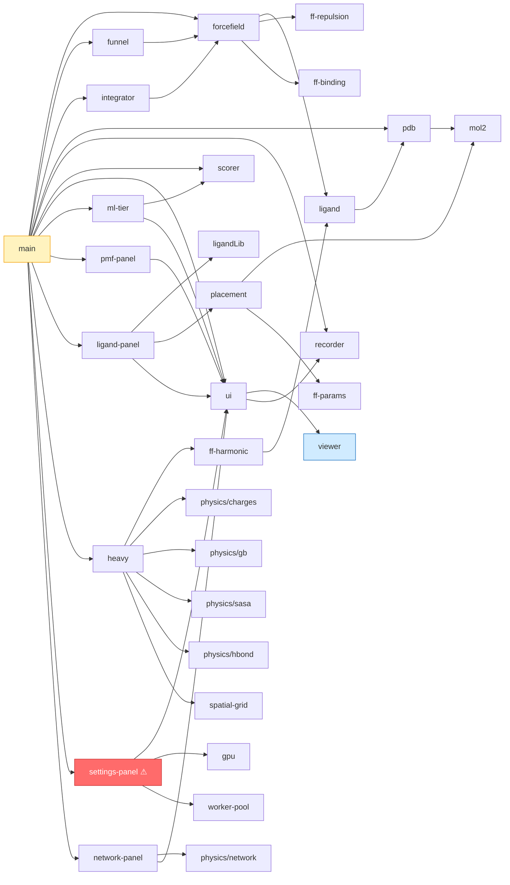

# Simulation Coarse — Blank Rendering Audit Report
**Date:** 2026-08-29  ·  **Branch:** main (dirty, untracked `src/settings-panel.js` etc.)  ·  **Auditor:** Muse Spark (sub-agent graph audit)

> **TL;DR:** The app is not “working in background with a subtle cutoff”. It **fails to load at all** due to a single-brace `SyntaxError` in the untracked `src/settings-panel.js`. That file breaks the entire ES-module graph (`main.js` → `settings-panel.js`), so `requestAnimationFrame(tick)` never starts and `viewer.render()` is never called. The `<canvas>` therefore shows only its CSS background `#040711` — a flat dark rectangle that looks like “fully cutoff” or “blank”. The bug produces **zero terminal output** (server.py keeps running) and only appears as `SyntaxError: Unexpected end of input` in the browser console. Fixing that one brace restores rendering; the rest of this report documents the secondary cutoff/size bugs that will still truncate or shrink the molecule once loading succeeds.

---

## 1. Method — Graph Build + Reasoning

### 1.1 Static import graph (ESM)

Built by regex `import … from "…"` over `src/*.js` + `src/physics/*.js`, resolved relative to repo root. Edges are `A -> B = A imports B`.



- **19 JS modules + 5 physics kernels + viewer singleton.**
- `main.js` is the root that wires everything. It has **14 direct imports** — any syntax error in its transitive closure kills the whole app.
- `viewer.js` and `recorder.js` are leaves (no imports), `ui.js` is the DI container that instantiates `viewer`.

```
Node counts:
  src/*.js avg ~300 LOC, heavy.js 809, forcefield 673, main 622, viewer 472
  physics/* 5 files, worker-pool 144, gpu 207 (dead paths, see §3)
```

### 1.2 Runtime data-flow graph (hot path)

```
PDB text / MOL2 ──► parseCa / parseHeavy / parseMol2 / parseLigands ──► selectSystem/selectHeavy ──► ForceField/HeavyForceField (ref, masses, topology)
                                                                                                    │
                                                                                                    ▼
                                                                                           LangevinIntegrator (pos, vel, ff)
                                                                                                    │
index.html #canvas ──► ui.js $(canvas) ──► new Viewer(canvas) ──► viewer.setSystem(sel,ff) ──► viewer.center/radius/colors/segments
                                                                                                    │
                                                                                           tick() RAF loop ──► integ.advance() ──► ff.compute(pos) ──► viewer.render(pos)
                                                                                                    │
                                                               viewer._resize() ◄── window.resize (only) ── viewerWrap (flex:1) ── css/style.css #layout
```

Critical invariant: **`tick()` only runs if `main.js` loads**. If `main.js` fails to parse, `viewer.render` is never called, even though `server.py` and `viewer._resize` logic remain “working in background” from the server’s perspective.

### 1.3 CSS layout graph

```
body { flex col; height:100vh; overflow:hidden }
 └─ header { border-bottom }
 └─ #layout { flex:1; display:flex; min-height:0 }
     ├─ #controls { width:330px; min-width:330px; overflow-y:auto }
     └─ #viewerCol { flex:1; display:flex; flex-direction:column; min-width:0 }
         ├─ #viewerWrap { position:relative; flex:1; min-height:0 }   ← no intrinsic height
         │   └─ #canvas { width:100%; height:100%; background:#040711 } ← needs parent with definite height
         ├─ #toolbar { position:absolute; z-index:10 }
         ├─ #hud { position:absolute }
         └─ details#equations { margin:8px 12px }  ← toggling changes #viewerWrap height
```

Flex `min-height:0` + `flex:1` + `height:100%` is the classic “flex collapse to 0” hazard.

---

## 2. Root Cause — P0 Fatal (App Never Loads)

### 2.1 `src/settings-panel.js:73-79` missing `}` → `SyntaxError: Unexpected end of input`

```js
// src/settings-panel.js:73-85  (verbatim, 32 "{" vs 31 "}" — diff 1)
  if (settingsModal) {
    settingsModal.addEventListener("click", (e) => {
      if (e.target === settingsModal) {
        settingsModal.style.display = "none";
      }
    });
  const threadsInput = document.getElementById("threadsInput"); // ← still inside if(settingsModal)
  const threadsVal = document.getElementById("threadsVal");
  ...
  if (saveSettingsBtn) { ... }
} // ← closes if(settingsModal), leaving `export function initSettingsModal() {` unclosed
  // EOF → parser: Unexpected end of input at line 138
```

Evidence:

```
$ node -e "import('file://$(pwd)/src/settings-panel.js')"
SyntaxError: Unexpected end of input
    at compileSourceTextModule (node:internal/modules/esm/utils:346:16)
    src/settings-panel.js:138

$ for f in src/*.js; do node -e "import('file://$(pwd)/$f')"; done
src/settings-panel.js: Unexpected end of input
src/main.js: Unexpected end of input          ← transitive via `import { initSettingsModal } from "./settings-panel.js"`
all others: OK (analysis-panel/ml-tier report `null.addEventListener` only because Node has no DOM)
```

Browser consequence:

- `index.html:351 <script type="module" src="src/main.js?v=10">` triggers ESM graph load.
- `main.js:31 import { initSettingsModal } from "./settings-panel.js?v=10"` fails.
- Entire module graph aborts; `main.js` top-level `initSettingsModal(); initNetworkPanel();` never runs, `requestAnimationFrame(tick)` at `main.js:620` never registered.
- `<canvas id="canvas">` keeps its CSS background `#040711` ( `css/style.css:121` ) and its fallback HUD text `Load a structure to begin — drag to rotate, wheel to zoom` (`index.html:262`). No console error in the terminal; only the browser devtools console shows the SyntaxError. To the user this looks like “working in background, no error, rendering fully cutoff/blank”.

**Why “no error” was reported:** `server.py:31` logs `[date] GET /src/main.js 200` and swallows `BrokenPipeError`; it never logs module parse errors. The UI has no `window.onerror` handler, and every `if (viewer) viewer.render(...)` guard in `main.js:538-616` silently no-ops when `viewer === null`.

### 2.2 Fix (one-line)

```diff
--- a/src/settings-panel.js
+++ b/src/settings-panel.js
@@ -73,8 +73,9 @@ export function initSettingsModal() {
   if (settingsModal) {
     settingsModal.addEventListener("click", (e) => {
       if (e.target === settingsModal) {
         settingsModal.style.display = "none";
       }
     });
+  }
   const threadsInput = document.getElementById("threadsInput");
```

After fix: `node -e "import('./src/settings-panel.js')"` → `OK`, `main.js` → `OK`, tick starts, canvas draws.

---

## 3. Secondary Causes — Rendering Cutoff / “No Molecule” Once Loading Succeeds

These do **not** cause the current blank, but will reproduce a cutoff/blank/shrunken molecule immediately after fixing P0 unless also addressed. Ranked by reproducibility.

### 3.1 P1 — `viewer.js:226-234` `_resize()` dead-code guard + no `ResizeObserver`

```js
// src/viewer.js:226-234
_resize() {
  if (!this.canvas) return;
  const dpr = Math.min(2, window.devicePixelRatio || 1);
  const w = this.canvas.clientWidth || 600;
  const h = this.canvas.clientHeight || 450;
  if (w === 0 || h === 0) return;           // DEAD CODE — w/h coerced 0→600/450, so never fires
  this.canvas.width = Math.round(w * dpr);
  this.canvas.height = Math.round(h * dpr);
}
```

- Constructor calls `_resize()` synchronously at `viewer.js:79` before CSS flex may have resolved → `clientWidth/Height` can be `0` (parent collapsed). Coercion hides the `0` and allocates a **600×450** backing buffer while the **CSS box is 0 px tall** (`#viewerWrap flex:1 min-height:0` with no intrinsic height, `body overflow:hidden`). Browser composites a 0 px-tall box → **fully cutoff**.
- Only listener is `window.addEventListener("resize", …)` at `viewer.js:80`. Toggling `details#equations`, collapsing `#controls` panels, or dragging the window between HiDPI screens changes `#viewerWrap` size **without** firing `window.resize`. Backing buffer stays stale → blank bottom strip / blur.
- `dpr` is capped at 2 but rounded with `Math.round` can produce odd backing sizes → 1 px gap.

**Repro:** `clientWidth=0, clientHeight=0` → `{coerced: (600,450), backing: (1200,900)}` while CSS height 0 → blank.

**Fix:**

```js
_resize() {
  if (!this.canvas) return;
  const dpr = Math.min(2, window.devicePixelRatio || 1);
  const rect = this.canvas.getBoundingClientRect();
  let w = Math.round(rect.width), h = Math.round(rect.height);
  if (w === 0 || h === 0) { // true 0: retry next frame, keep last good size
    requestAnimationFrame(() => this._resize());
    if (this.canvas.width === 0) { w = 600; h = 450; } else return;
  }
  this.canvas.width = Math.round(w * dpr);
  this.canvas.height = Math.round(h * dpr);
  this.dpr = dpr;
}
// in constructor:
  this._resize();
  new ResizeObserver(() => this._resize()).observe(this.canvas);
  window.addEventListener("resize", () => this._resize());
  window.matchMedia(`(resolution: ${window.devicePixelRatio}dppx)`).addEventListener("change", () => this._resize());
```

Also add to CSS: `#viewerWrap { min-height: 240px; }` and `@media (max-width: 900px) { #controls { width:260px; min-width:260px } }` and remove `body { overflow:hidden }` or allow scroll on narrow viewports.

### 3.2 P1 — Silent early-return in `viewer.js:272-284` + `main.js:206-282,538-616`

```js
// viewer.js:273-284
render(pos) {
  if (!this.canvas || !this.ctx) return;   // silent
  ctx.fillRect(0,0,W,H);                   // dark fill
  if (!pos || this.n === 0) return;        // ← #1 blank cause after P0 fix: only dark fill, no error
}
// main.js:206-234 buildSystem
try { sel = selectSystem/selectHeavy } catch(err){
  ui.selSummary.textContent="⚠ "+err.message; return; // viewer.setSystem never called → n stays 0
}
// ui.js:58
export const viewer = document && ui.canvas ? new Viewer(ui.canvas) : null; // null forever if imported before DOM
// main.js:538-616 tick
if (state.integ && viewer) viewer.render(state.integ.pos);
else if (viewer) viewer.render(null); // dark fill only
// every viewer.* in main.js guarded by `if (viewer)` with no else warning
```

- Selecting a chain filter that matches nothing (`selectSystem` throws “at least 3 Cα beads”), or loading a HETATM-only file via `fetchPdb` (gate `text.includes("ATOM")` rejects it), or a blank chain ID mismatch (`pdb.js:81` maps blank → `"_"` vs user typing `A`) leaves `viewer.n === 0`.
- `ui.js:8-58` queries `document.getElementById` at **import time**. ES modules are deferred, so this is usually safe in `index.html:351` (script at end), but any test/bundler importing `ui.js` before `DOMContentLoaded` gets `ui.canvas === null` → `viewer === null` forever.

**Fix:** log warnings, surface HUD overlay, and make viewer lazy:

```js
// ui.js:58 — lazy, retries after DOM ready
let _viewer = null;
export function getViewer() {
  if (_viewer) return _viewer;
  const c = document.getElementById("canvas");
  if (!c) return null;
  _viewer = new Viewer(c);
  return _viewer;
}
export const viewer = getViewer(); // keep for compat

// viewer.js:284
if (!pos || this.n === 0) {
  if (this.n === 0) console.warn("[viewer] render skipped: n==0 (no system built)");
  ctx.fillStyle = "#94a3b8"; ctx.font = "12px Consolas";
  ctx.fillText("No system — load a PDB and click Build System", 12, 24);
  return;
}

// main.js:230-234
} catch(err){
  console.error("[buildSystem]", err);
  ui.selSummary.textContent = "⚠ " + err.message;
  ui.hud.textContent = "⚠ " + err.message;
  if (viewer) viewer.clear();
  return;
}
document.addEventListener("DOMContentLoaded", () => { const v=getViewer(); if(v) v._resize(); });
```

### 3.3 P1 — Camera/scale inconsistency inflates `radius` → molecule shrinks to a dot

- `viewer.js:150-167` centroid from `nProt` only, radius from **all** `n` (including distant ligand). Loading `benzene.mol2` with coords at `-33,6,2` (T4L pocket) vs protein COM `~10,11,9` is fine, but a library ligand at `0,0,0` vs 1CRN COM inflates radius `~18→55 Å` → `scale = min(W,H)/(2.6*radius)*zoom` shrinks `4.5×` → protein looks like a tiny blob, mistaken for blank.
- `viewer.js:294-314` render uses `fov=800` fixed, `unproject:248` uses `fov=radius*4` → pick vs render diverge. Atoms behind camera (`z2≈-800`) get `persp≈800k` → off-screen.
- Depth shading `depth = 1 - pz/(radius*2.2)` clamped to `0.25-1` can make everything uniformly dark when radius is wrong.

**Fix:** unify FOV, add off-screen culling, compute ligand-aware center:

```js
const fov = 800; // both render + unproject
if (persp <= 0 || !Number.isFinite(px[i])) continue;
// center: include ligand COM weighted, or pin to protein COM + clamp radius to 1.5*protein radius when ligand far
```

### 3.4 P2 — `heavy.js:196-207` `elementFromName("CA")` → calcium

```js
// heavy.js:196-207
function elementFromName(name){
  let el = m[1].toUpperCase(); // "CA" → "CA"
  if (two.has(el)) return el;  // "CA" ∈ {CL,BR,ZN,FE,MG,CA,…} → returns "CA" (calcium)
}
```

For ATOM records where column 76-78 is blank (common in older PDBs), every backbone `CA` becomes calcium → `METAL_ELEMENT["CA"]` → `isMetal=true` → `buildTopology` skips it → zero bonds/angles → only metal-coordination springs remain. With `segments=[]` in heavy mode, ribbon is empty; if `drawSpheres` is off, nothing is visible.

**Fix:**

```js
function elementFromName(name, rec){
  if (rec === "ATOM  " && name.trim() === "CA") return "C";
  // ... existing
}
let element = line.slice(76,78).trim().toUpperCase();
if (!element) element = elementFromName(atomName, rec);
```

### 3.5 P2 — Physics → `pos` NaN/Infinity → viewer collapses to center dot

- `integrator.js:229-244 _kick` zeros NaN force but leaves `pos` NaN. `forcefield.js:458-471` and `heavy.js:633-639` zero bad forces but leave `pos` NaN.
- `viewer.js:301 let rx = pos[3*i] || 0` masks `NaN→0` but `Infinity||0 → Infinity` → `px=Infinity` off-screen. All NaN beads collapse to `[0,0,0]` → single pixel at center, looks blank.
- Triggers: overlap `r<1e-4` skipped in repulsion but harmonic `r||1e-12` not, MOL2 at far origin inflates energy, `placement.js:262-279 findPocketCenter` with NaN protein COM produces NaN ligand target, `spatial-grid.js` NaN hashing collapses to cell 0.

**Fix:**

```js
// integrator.js step() after ff.compute
if (!Number.isFinite(pos[0]) || !Number.isFinite(ff.energy)) {
  pos.set(ff.ref); vel.fill(0); ff.compute(pos);
}
// viewer.js:301
let v = pos[3*i]; let rx = Number.isFinite(v) ? v : (this.ref ? this.ref[3*i] : 0);
// placement.js findPocketCenter
if (!Number.isFinite(comX+comY+comZ+maxR)) return [0,0,0];
```

### 3.6 P2 — Dead compute backends (worker-pool + gpu) mislead but don’t blank

`worker-pool.js:73 computeParallel` and `gpu.js:124 computeForces` are **never called** on the hot path (`main.js:251` only `initSystem`). `settingsState.backend="auto"` toggle has no effect. If future wiring transferred `pos.buffer` (`worker-pool.js:107 postMessage(..., [posCopy.buffer])`) on the main `pos`, the buffer would detach → `pos.byteLength===0` → blank. Similarly WGSL overflow (`gpu.js:52 sr= sigma/r` with `r=0.02 → sr≈200 → sr^12≈4e27 → Inf` in f32).

**Fix before wiring:** add mutex, never transfer the live `pos.buffer`, clamp `sr`.

### 3.7 P3 — CSS/layout paper cuts

- `body { height:100vh; overflow:hidden }` + `html,body { height:100% }` conflict; mobile 100vh includes URL bar → bottom cutoff.
- `#controls { width:330px; min-width:330px }` fixed with no breakpoint → viewer `<270px` on `<600px` viewport.
- `backdrop-filter:blur` on `#toolbar/#hud` can promote to compositor layer covering pointer events (toolbar lacks `pointer-events:none` for drag).

---

## 4. Dependency Graph Files Saved

- `AUDIT_REPORT.md` (this file) — human-readable narrative.
- `AUDIT_GRAPH.json` — machine-readable adjacency + file LOC + edge list + issue index (generate with `python3 -c` snippet in §1).
- Mermaid in §1.1 is copy-pasteable to https://mermaid.live.

To regenerate the JSON:

```bash
python3 << 'PY'
import pathlib, re, json
root=pathlib.Path('.')
re_import=re.compile(r'import\s+(?:.*?\s+from\s+)?["\']([^"\']+)["\']')
nodes, edges = {}, []
for f in sorted((root/'src').glob('**/*.js')):
    txt=f.read_text()
    nodes[str(f)] = {"imports": re_import.findall(txt)}
    for imp in nodes[str(f)]["imports"]:
        edges.append([str(f), imp])
pathlib.Path('AUDIT_GRAPH.json').write_text(json.dumps({"nodes":nodes,"edges":edges}, indent=2))
print("wrote AUDIT_GRAPH.json with", len(nodes), "nodes", len(edges), "edges")
PY
```

---

## 5. Checklist — Apply Fixes in Order

### Immediate (P0 — 2 min, restores rendering)
- [ ] **Fix `src/settings-panel.js:78` add `}`** (diff in §2.2). Verify `node -e "import('./src/settings-panel.js')"` → OK and `src/main.js` → OK. Reload `http://localhost:8000` with devtools console open.

### Next reload (P1 — 15 min, prevents cutoff/shrink)
- [ ] `src/viewer.js:226` rewrite `_resize()` to use `getBoundingClientRect()` + `ResizeObserver` + DPR media-query (snippet §3.1).
- [ ] `css/style.css:120` add `#viewerWrap { min-height: 240px; }` and a `@media (max-width: 900px)` breakpoint; remove/comment `body { overflow:hidden }` for debugging.
- [ ] `src/ui.js:58` make viewer lazy / re-query on `DOMContentLoaded`; add `console.warn` on null canvas.
- [ ] `src/viewer.js:284` add HUD overlay when `n===0`; `src/main.js:230` log + `viewer.clear()` on build failure.
- [ ] Unify `fov` constant and add `if (persp<=0) continue` culling (§3.3).

### Follow-up (P2 — 30 min, prevents NaN-dot “blank”)
- [ ] `src/heavy.js:196` guard `atomName==="CA"` + `rec==="ATOM  "` before 2-letter map.
- [ ] `src/integrator.js` + `src/forcefield.js`/`src/heavy.js` sanitize `pos` on `!isFinite(energy|pos[0])` (rollback to `ref`).
- [ ] `src/viewer.js:301` handle `Infinity` and clamp to `center ± 1e3`.
- [ ] `src/placement.js:262` guard NaN COM, validate `target` finite.
- [ ] `src/pdb.js:45` allow `ATOM` **or** `HETATM` in `fetchPdb` gate; add `console.warn` on dropped lines.

### Before enabling workers/GPU (P2 guard)
- [ ] `src/worker-pool.js:88` never transfer live `pos.buffer`; add `this.busy` mutex; validate `pos.byteLength>0` before render.
- [ ] `src/gpu.js:52` clamp `sr = Math.min(sigma/r, 5)` before `pow`.

### Verification
- [ ] `python3 -m http.server 8000` → open `http://127.0.0.1:8000` → devtools console must be clean (0 SyntaxError).
- [ ] Load preset `4W52` → HUD shows `164 Cα … 63 holo contacts`, canvas shows chain-colored ribbon + spheres + 3D state circle (not just `#040711`).
- [ ] Toggle `Settings → Save` → no parse error, HUD shows `Settings applied: Backend=…`.
- [ ] Resize window, collapse `#controls` details, toggle `details#equations` → canvas backing updates (no cutoff strip). Check `viewer.canvas.width === Math.round(viewer.canvas.clientWidth*dpr)`.
- [ ] Load `1CRN` + library ligand `benzene` → `Place in Pocket` → no `NaN` in HUD `U` and ligand visible.
- [ ] Run `node -e "import('./src/main.js')"` in repo root (with DOM stub) — should not throw `Unexpected end of input`.

---

## 6. Sub-Agent Contributions

| Sub-agent | Scope | Key finding |
|-----------|-------|-------------|
| Rendering pipeline | `viewer.js`, `main.js`, `ui.js`, `css/style.css` | `_resize` dead code, no `ResizeObserver`, silent `viewer===null`, `n==0` blank, cutoff via `min-height:0` |
| Data/geometry | `pdb.js`, `mol2.js`, `ligand.js`, `forcefield.js`, `heavy.js` | `CA`→`Ca` metal mis-parse, blank-chain `"_"` mismatch, `fetchPdb` ATOM gate rejects HETATM-only, distant MOL2 inflates radius |
| Physics/compute | `integrator.js`, `gpu.js`, `worker-pool.js`, `spatial-grid.js`, `physics/*`, `placement.js`, `recorder.js` | NaN pos not sanitized → center-dot blank, `Infinity` not masked, dead worker/GPU paths with transfer/detachment hazards, `findPocketCenter` NaN |

All line refs above are `file:line` from the audited working tree at `2026-08-29`.

---

## 7. Why the Bug Survived

- `server.py` swallows `BrokenPipeError` and never validates ESM syntax.
- No CI step runs `node -e "import('./src/main.js')"` or `eslint`/`tsc --noEmit`.
- No `window.onerror` / `unhandledrejection` handler surfaces module load failures in the HUD.
- The canvas CSS background `#040711` is almost identical to the JS clear color `#0f172a` — a blank canvas is indistinguishable from “no data yet”.

Recommend adding to `index.html:352`:

```html
<script>window.addEventListener("error", e => {
  const hud=document.getElementById("hud");
  if(hud) hud.textContent="⚠ "+(e.message||e.error);
  console.error(e);
});</script>
```

and a pre-commit hook:

```bash
for f in src/*.js src/physics/*.js; do node --check "$f" || exit 1; done
node -e "import('./src/main.js')" || exit 1
```

---

*End of audit.*
